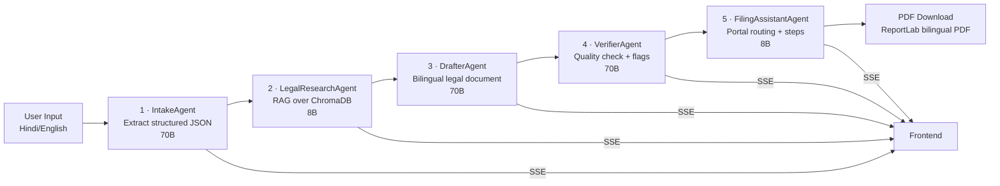

# NyayaMitra — Full Project Context

> **न्यायमित्र** = Justice Friend — AI legal document drafting for Indian citizens

## Overview

NyayaMitra is a multi-agent AI system that takes a casual Hindi/English case description and produces a print-ready bilingual (EN/HI) legal document. It supports **5 document types**: FIR, Legal Notice, Consumer Complaint, Cheque Bounce Notice, and Tenant Eviction Notice.

---

## Architecture



### Key Design Decisions
- **Sequential 5-agent pipeline** — each agent receives output from the previous
- **SSE streaming** — real-time status updates to frontend via in-memory `asyncio.Queue` per session
- **Dual-model strategy** — Llama 3.3 70B for quality-critical agents (Intake, Drafter, Verifier); Llama 3.1 8B Instant for utility agents (Research, FilingAssistant) — conserves 70B token quota
- **ChromaDB + sentence-transformers** — local RAG over 1,423 real Indian law sections (section-level, not chunks)
- **All free-tier** — no paid services required

---

## Indian Law Context (Critical)

Three colonial-era criminal laws were replaced on **1 July 2024**:

| Old Law | New Law | Abbreviation |
|---------|---------|--------------|
| Indian Penal Code (IPC) 1860 | Bharatiya Nyaya Sanhita 2023 | **BNS** |
| Cr.P.C. 1973 | Bharatiya Nagarik Suraksha Sanhita 2023 | **BNSS** |
| Indian Evidence Act 1872 | Bharatiya Sakshya Adhiniyam 2023 | **BSA** |

**Unchanged**: NI Act 1881 (§138 cheque bounce), Consumer Protection Act 2019, Transfer of Property Act 1882, Rent Control Acts.

> **Rule: NEVER cite IPC/CrPC — always use BNS/BNSS/BSA equivalents.**

---

## Project Structure

```
nyayamitra/
├── CLAUDE.md                    # Agent guidelines + subagent routing rules
├── README.md                    # Project docs + quick start
├── backend/
│   ├── main.py                  # FastAPI entry point (skeleton — routes are TODOs)
│   ├── requirements.txt         # 14 Python deps
│   ├── .env.example             # GROQ_API_KEY
│   ├── agents/
│   │   ├── __init__.py
│   │   ├── intake.py            # IntakeAgent — extracts structured case JSON
│   │   ├── research.py          # LegalResearchAgent — RAG + law section ranking
│   │   ├── drafter.py           # DrafterAgent — bilingual formal document
│   │   └── verifier.py          # VerifierAgent — quality check + flags
│   ├── services/
│   │   ├── __init__.py
│   │   ├── groq_client.py       # AsyncGroq wrapper (Llama 3.3 70B)
│   │   ├── chroma_service.py    # ChromaDB singleton + query_laws()
│   │   ├── sse.py               # In-memory asyncio.Queue SSE streaming
│   │   └── pdf_generator.py     # ReportLab bilingual PDF (EN + HI pages)
│   ├── db/
│   │   ├── __init__.py
│   │   ├── init_db.py           # SQLite schema + template seeding
│   │   └── templates.json       # 5 document templates with {{placeholders}}
│   ├── data/laws/
│   │   └── .gitkeep             # PDFs must be added here before seeding
│   └── seed_chroma.py           # One-time ChromaDB indexing (PDF → chunks)
└── frontend/
    ├── index.html               # Google Fonts (Noto Sans/Serif Devanagari)
    ├── package.json             # React 18 + Vite 6 + Tailwind 3
    ├── vite.config.js           # Dev proxy to localhost:8000
    ├── tailwind.config.js       # Custom Devanagari font family
    └── src/
        ├── main.jsx             # React bootstrap
        ├── index.css            # Tailwind directives + Devanagari font class
        ├── App.jsx              # 3-stage wizard: SELECT_DOC → INPUT_CASE → VIEW_RESULTS
        ├── components/
        │   ├── DocTypeSelector.jsx    # 5 document type cards
        │   ├── CaseInput.jsx          # Text area + demo text + char count
        │   ├── AgentPipeline.jsx      # 4-agent status grid with SSE
        │   ├── DraftPreview.jsx       # Paper-style doc with EN/HI toggle
        │   ├── VerifierFlags.jsx      # Quality report + flags + suggestions
        │   └── PDFDownload.jsx        # Download button
        ├── hooks/
        │   └── useSSE.js             # EventSource hook for /stream/{sessionId}
        └── lib/
            └── api.js                # API client: startPipeline, downloadPdf, generateSessionId
```

---

## Implementation Status

### ✅ Fully Implemented
| Component | Status | Notes |
|-----------|--------|-------|
| All 5 agents | ✅ | intake, research, drafter, verifier, filing_assistant |
| Groq client | ✅ | Dual-model: MODEL_LARGE (70B) / MODEL_FAST (8B), 3-retry backoff, per-agent max_tokens |
| ChromaDB service | ✅ | Lazy singleton — `init_chroma()`, `query_laws()`, `get_indexed_count()` |
| SSE service | ✅ | `asyncio.Queue` per session — `push_event()`, `close_stream()`, `create_sse_generator()` |
| PDF generator | ✅ | ReportLab bilingual PDF → `generated_pdfs/nyayamitra_{session_id}.pdf` |
| Seed script | ✅ | Parses .txt files by section regex, deduplicates TOC/body, drops+recreates collection |
| ChromaDB corpus | ✅ | 1,423 real sections from 7 acts, real section numbers (no chunk_ IDs) |
| ChromaDB metadata | ✅ | Each section: `{act, section, title, use_cases, source_file}` |
| intake.py | ✅ | Captures `incident_time` + `parties[].contact` |
| drafter.py | ✅ | Stolen items list, assailant description, CCTV request, [bracketed placeholders] |
| research.py | ✅ | Filters chunk_ IDs post-Groq as safety net |
| filing_assistant.py | ✅ | 10-state e-FIR routing, violence detection, e-Daakhil, Speed Post guide, bilingual steps |
| Pydantic schemas | ✅ | `schemas.py` — PipelineRequest, IncidentJSON, LegalSection, VerificationResult, PipelineEvent |
| main.py routes | ✅ | All 4 routes wired: POST /pipeline, GET /stream/{sid}, GET /download-pdf/{sid}, GET /health |
| Pipeline orchestrator | ✅ | `run_pipeline()` chains all 5 agents as BackgroundTask |
| SQLite DB | ✅ | Schema + 5 template upserts from `templates.json` |
| All 7 React components | ✅ | DocTypeSelector, CaseInput, AgentPipeline, DraftPreview, VerifierFlags, PDFDownload, FilingAssistant |
| SSE hook | ✅ | `useSSE()` tracks draft + verification + filingData |
| API client | ✅ | `startPipeline()`, `downloadPdf()`, `generateSessionId()` |
| backend/.env | ✅ | Created — needs real GROQ_API_KEY value |

### ❌ Remaining Blockers
| Item | What's Needed |
|------|---------------|
| **GROQ_API_KEY** | Add real key to `backend/.env` |
| **End-to-end test** | Run server + frontend, submit a test case |
| **Frontend .env.local** | `VITE_API_URL=http://localhost:8000` |

---

## API Contract

| Endpoint | Method | Request | Response |
|----------|--------|---------|----------|
| `/pipeline` | POST | `{ doc_type, description, session_id }` | `{ ok: true }` |
| `/stream/{session_id}` | GET (SSE) | — | Events: `{ agent, status, data }` |
| `/download-pdf/{session_id}` | GET | — | PDF file stream |
| `/health` | GET | — | `{ status, agents, laws_indexed }` |

---

## Tech Stack Summary

| Layer | Technology | Version |
|-------|-----------|---------|
| **Backend** | Python + FastAPI | 3.12 / 0.115.6 |
| **LLM (quality)** | Groq — Llama 3.3 70B | groq 0.12.0 |
| **LLM (utility)** | Groq — Llama 3.1 8B Instant | groq 0.12.0 |
| **Vector DB** | ChromaDB | 0.5.23 |
| **Embeddings** | sentence-transformers (all-MiniLM-L6-v2) | 3.3.1 |
| **PDF** | ReportLab | 4.2.5 |
| **SSE** | sse-starlette | 2.1.3 |
| **Frontend** | React 18 + Vite 6 | 18.3.1 / 6.0.5 |
| **Styling** | Tailwind CSS 3 | 3.4.16 |
| **Deploy** | Railway (backend) + Vercel (frontend) | — |

---

## Key Observations

1. **Backend is fully wired** — all 5 agents, services, routes, and pipeline orchestrator implemented. Only a real `GROQ_API_KEY` is needed to run.

2. **ChromaDB has real section numbers** — 1,423 sections from 7 .txt law files parsed at section level (no chunk_ IDs). `seed_chroma.py` drops and recreates the collection on each run for a clean slate. section regex: `^\d{1,3}[A-Z]?\. Title.—body`.

3. **RAG schema** — each section carries `{act, section, title, use_cases, source_file}`. `query_laws(incident_type, description, top_k=10)` returns ranked results by cosine similarity. research.py filters any stray chunk_ IDs post-Groq.

4. **Dual-model token strategy** — 70B (100K TPD) used only for Intake + Drafter + Verifier. 8B Instant (500K TPD) for Research + FilingAssistant. Per-pipeline token budget ~6K vs ~20K before.

5. **FilingAssistantAgent** — pure Python portal routing (no LLM needed for routing decision), Groq 8B for step generation. Violence keywords gate e-FIR eligibility. 10 states supported with portal URLs.

6. **Frontend is UI-complete** — 7 components, SSE hook tracks filingData, FilingAssistant renders after VerifierFlags with portal card + steps + field mapping table + warnings.

7. **Only remaining work** — add `GROQ_API_KEY` to `backend/.env`, add `VITE_API_URL` to `frontend/.env.local`, run end-to-end test.

8. **Design system** — dark mode zinc-950 palette with amber accents. Tailwind. Bilingual with Noto Sans/Serif Devanagari Google Fonts.

9. **Subagent routing** — `backend-engineer` handles Python/backend/, `frontend-engineer` handles React/frontend/. Cross-cutting tasks spawn both in parallel.
